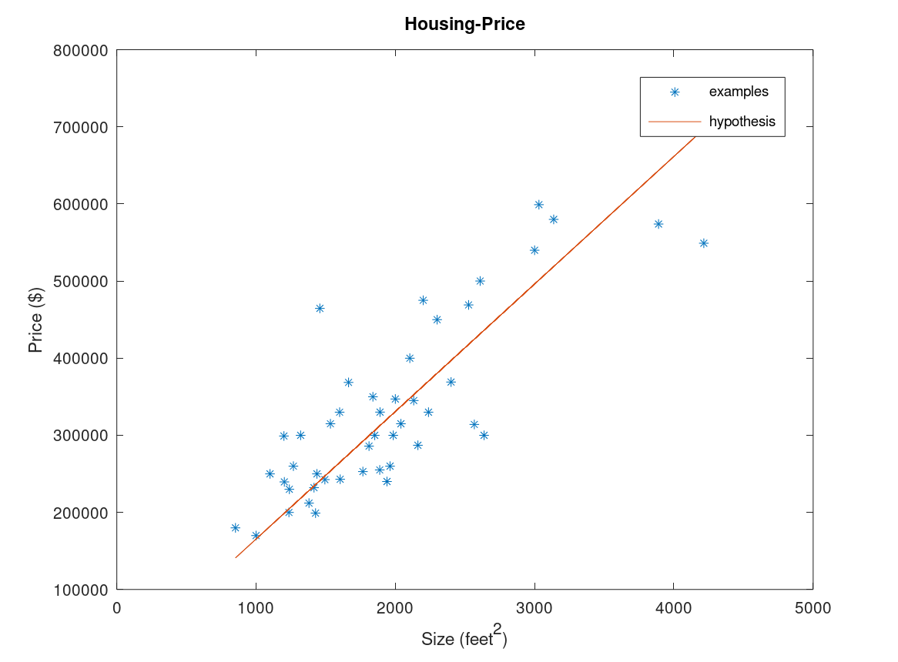

# Housing price
## Info
- feature : Size (feet^2)

- output : Price($)
## About

Predicting housing price with respect to a size of the house by using linear regression

## Output

### Examples

**x0 : ones matrix multiplying with theta0**

**x1 : first column of featuresX.dat; Size(feet^2)**

**y : column of priceY.dat; Price($)**

### Theta

theta0 = 71270.49245

theta1 = 134.52529

### Hypothesis function

**h(x) = theta1\*x1 + theta0\*x0 = 71270.49245\*x1 + 134.52529\*x0**

